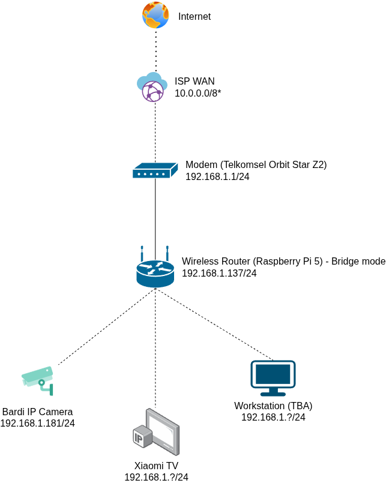
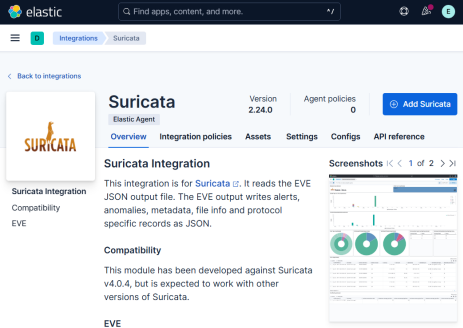
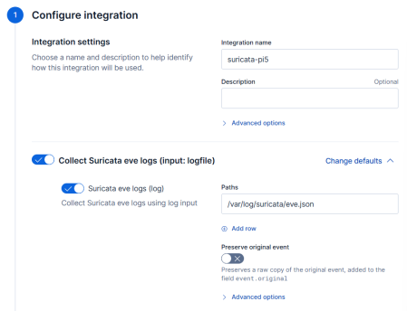
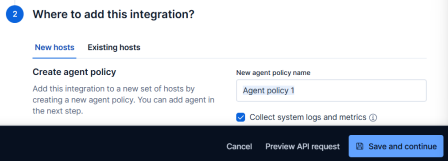
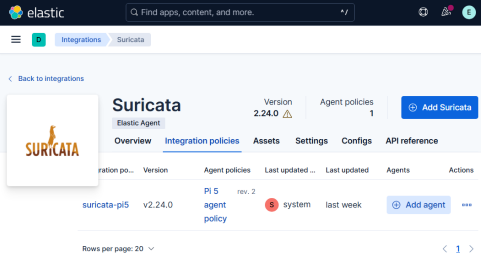
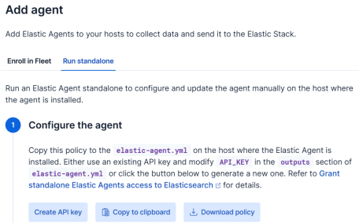

# Pi 5 Home Security

## Prerequisites

### Hardware Requirements

- Raspberry Pi 5, 8 GB RAM variant ([link](https://www.raspberrypi.com/products/raspberry-pi-5/))
- Raspberry Pi M.2 HAT+ ([link](https://www.raspberrypi.com/products/m2-hat-plus/))
- M.2 NVMe SSD
    - 256 GB (Samsung PM991) is used for this project, but 64 GB should be sufficient
- WiFi-capable IoT devices; for this project:
    - Bardi IDR-IPC-STC
    - Xiaomi MiTV-MOSR1

> [!WARNING]
> SSD (and M.2 HAT+) are not strictly required. However, read/write operations incurred by Suricata and Elasticsearch are very heavy and will quickly tear down your SD card.
> For this reason, I highly recommend **migrating your installation from SD card to SSD.**

### Software Requirements

- OS: Raspberry Pi OS Lite 64-bit
- Firewall: nftables
- IDS: Suricata
- Log ingestion: Elasticsearch & Kibana

View the [Setup](#setup) section for more details.

### Network Topology

The RPi 5 is bridged to a router/modem (in this case, Telkomsel Orbit Star Z2) and acts as the WiFi access point/hotspot to several client devices:

- Bardi IDR-IPC-STC (IP camera)
- Xiaomi MiTV-MOSR1 (smart TV)
- Ubuntu VM, running on KVM with a dedciated network interface via USB passthrough

All IP addresses are obtained via MAC-based DHCP (a la Dnsmasq), which makes them stable even if their leases expire.



## Setup

### Migrating to SSD

> [!NOTE]
> Skip this section if you insist on running your installation on SD card.

- Ensure that your SSD is attached and take note of the block name (it should be something like `nvmeXnY`:

  ```
  $ lsblk
  NAME        MAJ:MIN RM   SIZE RO TYPE MOUNTPOINTS
  mmcblk0     179:0    0 232.2G  0 disk
  ├─mmcblk0p1 179:1    0   512M  0 part /boot/firmware
  └─mmcblk0p2 179:2    0 231.7G  0 part /
  nvme0n1     259:0    0 238.5G  0 disk
  ├─nvme0n1p1 259:1    0   512M  0 part
  └─nvme0n1p2 259:2    0   238G  0 part
  ```

- Clone your existing installation to SSD using [`rpi-cloner`](https://github.com/geerlingguy/rpi-clone) and follow the given instructions:

  ```
  curl https://raw.githubusercontent.com/geerlingguy/rpi-clone/master/install | sudo bash
  sudo rpi-clone nvme0n1
  ```

- Append the following to `/boot/firmware/config.txt` in order to enable the PCIe port:

  ```
  dtparam=nvme

  # You can also upgrade the PCIe lane speed to Gen 3 by adding this parameter (this is experimental)
  #dtparam=pciex1_gen=3
  ```

- Modify the boot order so that the NVMe drive gets checked first:

  ```
  sudo rpi-eeprom-config --edit
  ```

  Then modify the `BOOT_ORDER`
  ```
  BOOT_ORDER-0xf416
  ```
  The `6` at the end tells the ROM to attempt NVMe boot first. Check the [documentation](https://www.raspberrypi.com/documentation/computers/raspberry-pi.html#BOOT_ORDER) for more details. Reboot your RPi for the changes to take effect.

### WiFi AP

Run the following commands to create a WiFi access point bridged with your modem/router via Ethernet (adjust `$SSID` and `$PASSWORD`):

```
sudo nmcli device wifi Hotspot ssid $SSID password $PASSWORD ifname wlan0  # Can use names other than 'Hotspot'
sudo nmcli connection modify Hotspot ipv4.method disabled ipv6.method disabled  # don't assign any IP address since this will be bridged
sudo nmcli connection up Hotspot
```

Check the status of your WiFi AP by running `ip a` (it should be up without any IP address):

```
$ ip a
...
3: wlan0: <BROADCAST,MULTICAST,UP,LOWER_UP> mtu 1500 qdisc pfifo_fast
state UP group default qlen 1000
 link/ether xx:xx:xx:xx:xx:xx brd ff:ff:ff:ff:ff:ff
```

### Suricata

#### Installation

Suricata is to be compiled from source and run with the AF_PACKET (layer 2) mode:

```
# Update
sudo apt-get update && sudo apt-get -y full-upgrade

# Install dependencies
sudo apt-get -y install wget libpcre2-dev build-essential autoconf
automake libtool libpcap-dev libnet1-dev libyaml-0-2 libyaml-dev pkgconfig zlib1g zlib1g-dev libcap-ng-dev libcap-ng0 make libmagic-dev
libjansson-dev rustc cargo jq git-core install libnetfilter-queue-dev
libnetfilter-queue1 libnfnetlink-dev libnfnetlink0

# Download the source code
wget https://www.openinfosecfoundation.org/download/suricata-7.0.0.tar.gz
tar -xvzf suricata-7.0.0.tar.gz -C suricata
cd suricata

# Configure installation and compile
./configure --prefix=/usr --sysconfdir=/etc --localstatedir=/var
make
sudo make install
sudo python ./suricata-update/setup.py build && sudo python ./suricataupdate/setup.py
sudo make install-full
sudo suricata-update
```

#### Configuration

Open Suricata's configuration file (`/etc/suricata/suricata.yml`) and do the following:

> [!NOTE]
> Configuration and custom detection rule files are available at [`config/suricata/suricata.yml`](config/suricata/suricata.yaml) and [`config/suricata/local.rules`](config/suricata/local.rules), respectively.

- Modify `HOME_NET` to reflect your LAN subnet (in this case, 192.168.1.0/24)

  ```yaml
  HOME_NET: "[192.168.1.0/24]"
  ```

- Modify `HTTP_PORTS` to include both 80 and 443

  ```yaml
  HTTP_PORTS: "[80, 443]"
  ```

- Set up `AF_PACKET` mode

  ```yaml
  af-packet:
    - interface: eth0
      threads: auto
      cluster-id: 99
      cluster-type: cluster_flow
      defrag: no
      use-mmap: yes
      ring-size: 32768
      buffer-size: 64535
      copy-mode: tap
      copy-iface: wlan0
    - interface: wlan0
      threads: auto
      cluster-id: 90
      cluster-type: cluster_flow
      defrag: no
      use-mmap: yes
      ring-size: 32768
      buffer-size: 64535
      copy-mode: tap
      copy-iface: eth0
  ```

- Include `local.rules` in the `rule-files` section:

  ```yaml
  rule-files:
    suricata.rules
    local.rules
  ```

#### Integrate with Systemd Service

Run Suricata as a Systemd service by creating a service file at `/etc/systemd/suricata.service`:

> [!NOTE]
> The Systemd service file is available at [`config/suricata/suricata.service`](config/suricata/suricata.service).

```
[Unit]
Description=Suricata Intrusion Detection Service
After=syslog.target network-online.target

[Service]
ExecStart=/usr/bin/suricata -c /etc/suricata/suricata.yaml --af-packet
ExecReload=/bin/kill -HUP $MAINPID
ExecStop=/bin/kill $MAINPID

[Install]
WantedBy=multi-user.target
```

#### Custom Rules & Threshold

These custom rules, defined at `/var/lib/suricata/rules/local.rules`, are mostly concerned with LAN activities. Threshold configuration (`/etc/suricata/threshold.config`) is defined to limit the alerts generated by volumetric (DoS) attacks. You may want to define your own custom rules and threshold configuration, depending on your network environment.

> [!NOTE]
> The custom rule and threshold files are available at [`config/suricata/local.rules`](config/suricata/local.rules) and [`config/suricata/threshold.config`](config/suricata/threshold.config)

```
alert tcp any any -> 192.168.1.181 any (msg:"[LOCAL] Bardi RTSP Access"; content:"RTSP/"; classtype:misc-activity; sid:9625001; rev:1;)
drop tcp any any -> 192.168.1.77 5555 (msg:"[LOCAL] Xiaomi MiTV ADB Access"; classtype:misc-activity; sid:9625002; rev:1;)
alert http any any -> 192.168.1.77 [8008, 8009, 8443] (msg:"[LOCAL] Xiaomi MiTV Chromecast Connection"; classtype:misc-activity; sid:962503; rev:1;)
alert tcp any !$HTTP_PORTS -> $HOME_NET any (msg:"[LOCAL] Potential TCP SYN Flood"; flags:S; classtype:attempted-dos; sid:962504; rev:1;)
alert icmp any any -> $HOME_NET any (msg:"[LOCAL] Potential ICMP Flood"; itype:8; icode:0; classtype:attempted-dos; sid:962505; rev:1;)
alert udp any any -> $HOME_NET any (msg:"[LOCAL] Potential UDP Flood"; flow:not_established,to_server; flowbits:isnotset,udp_verify; flowbits:set,udp_verify; classtype:attempted-dos; sid:962506; rev:1;)
alert http any any -> 192.168.1.1 443 (msg:"[LOCAL] Router Control Panel Access"; classtype:misc-activity; sid:962507; rev:1;)
```

```
threshold gen_id 1, sig_id 962504, type both, track by_dst, count 150, seconds 300
threshold gen_id 1, sig_id 962505, type both, track by_dst, count 150, seconds 300
threshold gen_id 1, sig_id 962506, type both, track by_dst, count 250, seconds 300
```

### nftables

If nftables isn't installed yet, run the following commands:

```
sudo apt install -y nftables
sudo systemctl enable --now nftables
```

This nftables configuration serves to harden the RPi device. I originally intended to use nftables to block suspicious activites occuring in-between LAN devices, but it appears to be not possible since nftables cannot act as an ARP proxy.

> [!NOTE]
> Nftables configuration is available at [`config/nftables/nftables.conf`](config/nftables/nftables.conf)

```
table ip filter {
	chain input {
		type filter hook input priority filter; policy drop;

		iif lo accept comment "Accept localhost traffic"
		fib daddr . iif type != { local, broadcast, multicast } drop comment "Drop packets whose destination is not configured on the incoming interface"
		ct state invalid drop comment "Drop invalid connections"
		ct state { established, related } accept comment "Accept traffic originating from this host"

		meta l4proto icmp icmp type echo-request limit rate over 10/second burst 5 packets drop comment "Block ICMP ping flood"
		meta l4proto tcp tcp flags & (fin|syn|rst|ack) == syn limit rate over 10/second burst 5 packets drop comment "Block TCP SYN flood"
		meta l4proto udp limit rate over 50/second burst 25 packets drop comment "Block UDP flood"

		meta l4proto icmp accept comment "Accept ICMP"
		tcp dport ssh accept comment "Accept SSH"
	}

	chain forward {
		type filter hook forward priority filter; policy drop; # Forwarding is handled by bridge
	}

	chain output {
		type filter hook output priority filter; policy accept; # Accept any outbound connection
	}
}
```

Afterwards, restart nftables by running the following command:

```
sudo systemctl restart nftables
```

### Elasticsearch

Import Elasticsearch's GPG signing key:

```
wget -qO https://artifacts.elastic.co/GPG-KEY-elasticsearch | sudo gpg --dearmor -o /usr/share/keyrings/elasticsearch-keyring.gpg # Download the GPG signing key
sudo apt-get install apt-transport-https # To enable APT download over HTTPS
echo "deb [signed-by=/usr/share/keyrings/elasticsearch-keyring.gpg] https://artifacts.elastic.co/packages/9.x/apt stable main" | sudo tee /etc/apt/sources.list.d/elastic-9.x.list # Store repository definition
sudo apt-get update && sudo apt-get install elasticsearch # Update
repositories and install Elasticsearch
```

Upon successful installation, you will be shown a prompt containing the generated credentials for the `elastic` account, as well as an instruction to run Elasticsearch as a Systemd service.

```
--------------------------- Security autoconfiguration information ------------------------------

Authentication and authorization are enabled.
TLS for the transport and HTTP layers is enabled and configured.

The generated password for the elastic built-in superuser is : hj+YKgyhJ--KK8hNJ24Z

If this node should join an existing cluster, you can reconfigure this with
'/usr/share/elasticsearch/bin/elasticsearch-reconfigure-node --enrollment-token <token-here>'
after creating an enrollment token on your existing cluster.

You can complete the following actions at any time:

Reset the password of the elastic built-in superuser with
'/usr/share/elasticsearch/bin/elasticsearch-reset-password -u elastic'.

Generate an enrollment token for Kibana instances with
'/usr/share/elasticsearch/bin/elasticsearch-create-enrollment-token -s kibana'.

Generate an enrollment token for Elasticsearch nodes with
'/usr/share/elasticsearch/bin/elasticsearch-create-enrollment-token -s node'.

-------------------------------------------------------------------------------------------------

### NOT starting on installation, please execute the following statements to configure elasticsearch service to start automatically using systemd
 sudo systemctl daemon-reload
 sudo systemctl enable elasticsearch.service
### You can start elasticsearch service by executing
 sudo systemctl start elasticsearch.service
```

> [!IMPORTANT]
I recommend limiting the memory allocation of JVM (Java Virtual Machine, which is used to run the Elastic stack) to avoid memory issues while running other applications by creating a new file at `/etc/elasticsearch/jvm.options.d/jvm-heap.options` and adding the following JVM arguments:
>
> ```
> -Xms2g
> -Xmx2g
> ```

### Kibana

Install and run Kibana as a Systemd service by running the following commands:

```
sudo apt install kibana
sudo systemctl enable --now kibana
```

You should now be able to open Kibana by going to `http://localhost:5601`.

### Integrating Suricata with Elasticsearch & Enabling Resource Monitoring

1. Open Kibana at `http://localhost:5601`.

2. Go to _Management_ > _Integrations_, then search for Suricata.

3. Click "Add Suricata".

   

4. On "Configure integration", add a name for the integration instance and ensure "Collect Suricata eve logs (input: logfile)" is toggled on.

   

5. On "Where to add this integration", choose "New hosts" and name the agent policy. Ensure "Collect system logs and metrics" is toggled on so that resource monitoring is enabled alongside the Suricata integration.

   

6. Click "Save and continue".

7. You will be shown a prompt to add Elastic Agent to the RPi host. Elastic agent acts as a log forwarder from Suricata to Elasticsearch. Click "Add Elastic Agent to your hosts".

8. On "Integration policies," click "Add agent" and choose the "Run standalone" option.

   

9. On "Configure the agent," click "Create API key" so that Elastic Agent can forward the log data securely. Save the generated configuration file to `/etc/elastic-agent/elastic-agent.yml`.

   

10. Install Elastic Agent via the Elasticsearch APT repository and run it as a Systemd service:

   ```
   sudo apt install elastic-agent
   sudo systemctl enable --now elastic-agent
   ```

You can now view all alerts generated by Suricata and monitor the RPi's resource usage through the pre-built dashboards on _Analytics_ > _Dashboards_.

## Monitoring Data

As part of evaluation, the system was run for 24 hours from 16 June 2025 at 14:05 to 17 June 2025 at 14:05. All raw data files are available on [monitoring_data](monitoring_data). To summarise:

- A total of 1,205,093 packets (~302 MB) was processed
  - **No packet loss was observed**
- Average CPU consumtion was ~2.5% with little fluctuation.
- Average memory (RAM) consumption was ~5.68 GB
  - High consumtpion attributed to Java which is used by the Elastic stack